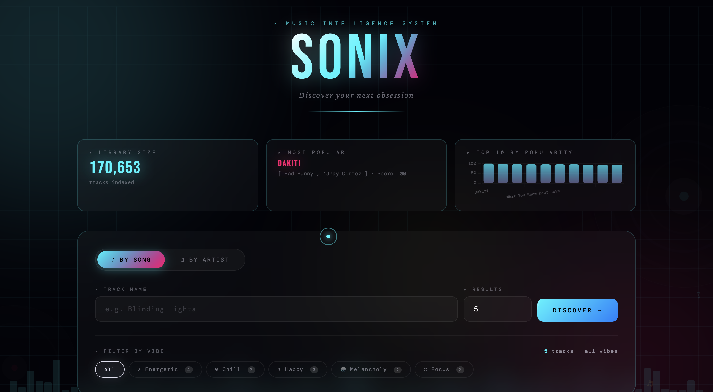
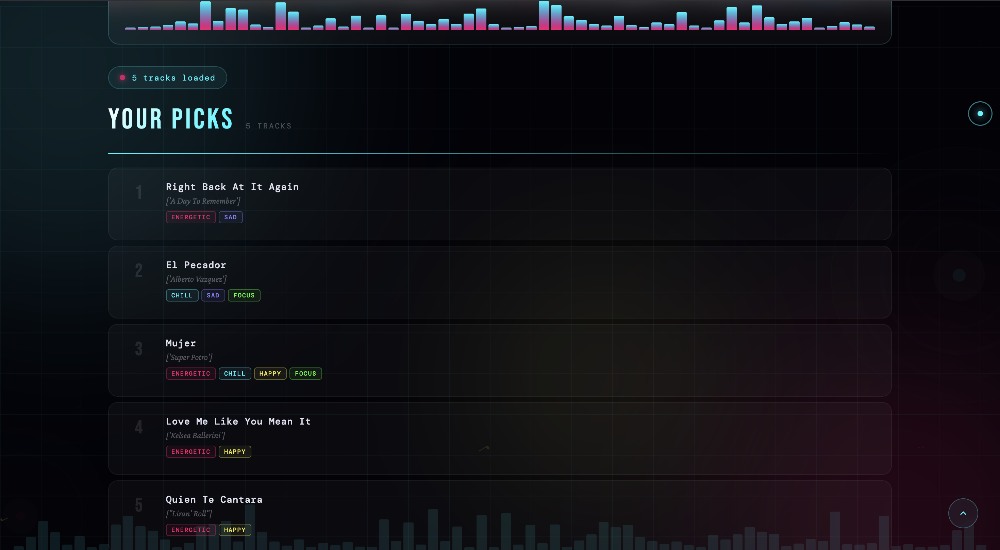
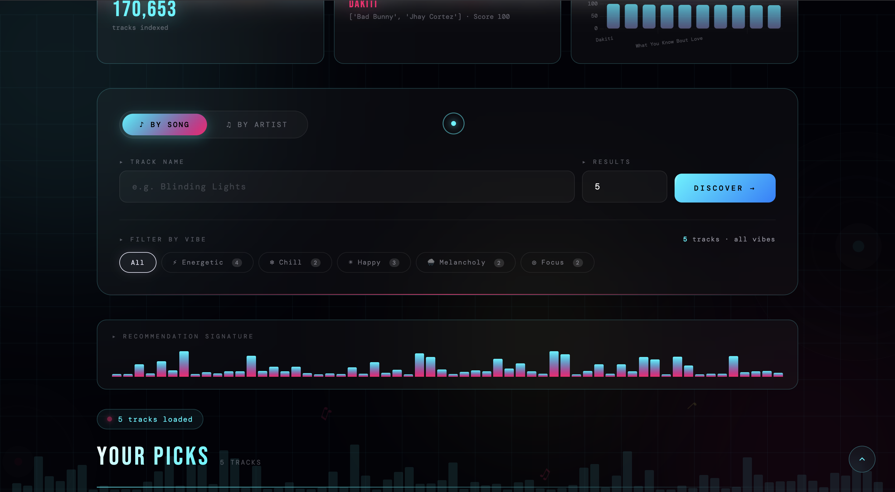

# Music Recommendation System

## Overview
This project is a web-based Music Recommendation System built with Python (Flask) and machine learning. It allows users to:
- Get song recommendations by entering a song name.
- Search for songs by artist.
- View analytics such as total songs, most popular song, and a popularity chart.
- Enjoy a modern, interactive, and visually appealing user interface.

## Features
- **Song Recommendation:** Enter a song name to get similar song recommendations using clustering and distance-based logic.
- **Artist Search:** Find songs by a specific artist with autocomplete support.
- **Analytics Dashboard:** See total number of songs, most popular song, and a bar chart of the top 10 songs by popularity.
- **Autocomplete:** Both song and artist search fields support autocomplete for a smooth user experience.
- **Modern UI:** Responsive, beautiful design with Bootstrap, custom CSS, and interactive charts.

## Screenshots

### Home Page & Analytics


### Song Recommendation Example


### Artist Search Example



## Project Structure
```
Music-Recommendation-System/
├── app.py
├── .venv
├── Training.py
├── Dataset/
│   └── data.csv
├── templates/
│   └── index.html
├── __pycache__/
├── s1.png
├── s2.png
├── s3.png
└── README.md
```

## How It Works
- The backend loads a large dataset of songs and uses clustering (KMeans) and distance metrics to recommend similar songs.
- The frontend provides a user-friendly interface for searching and viewing recommendations and analytics.
- Autocomplete is powered by Flask endpoints for both song and artist fields.
- Analytics are computed from the dataset and visualized with Chart.js.

## How to Run
1. **Clone the repository:**
   ```bash
   git clone https://github.com/Nisch9/Music-Recommendation-System.git
   cd Music-Recommendation-System
   ```
2. **Set up a virtual environment (recommended):**
   ```bash
   python3 -m venv .venv
   source .venv/bin/activate
   ```
3. **Install dependencies:**
   ```bash
   pip install flask pandas numpy matplotlib seaborn tqdm scikit-learn
   ```
4. **Ensure your dataset is in `Dataset/data.csv`.**
5. **Run the application:**
   ```bash
   python app.py
   ```
6. **Open your browser and go to:**
   [http://127.0.0.1:5000](http://127.0.0.1:5000)

## Customization
- To change the look and feel, edit `templates/index.html` and the CSS inside it.
- To improve or change the recommendation logic, edit `Training.py`.
- To use a different dataset, replace `Dataset/data.csv` with your own (ensure the format matches).

## License
This project is for educational and demonstration purposes.

---
Enjoy discovering new music!
